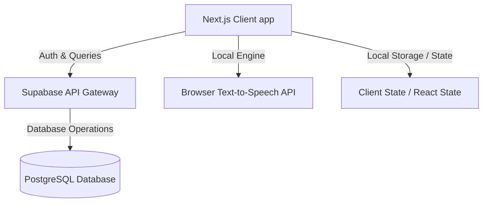

# MeinDeutsch

<div align="center">
  
  <h3>An Interactive German Learning Platform Aligned with CEFR Standards</h3>
  <p>Learn, practice, and master German with structured pathways covering reading, listening, writing, and speaking.</p>

  [](https://nextjs.org)
  [](https://react.dev)
  [](https://www.typescriptlang.org)
  [](https://supabase.com)
  [](https://tailwindcss.com)
  [](LICENSE)
</div>

---

## About The Project

**MeinDeutsch** is a modern, web-based German learning platform designed to help learners transition from passive vocabulary collection to active linguistic mastery. By structuring curriculum paths according to the **Common European Framework of Reference for Languages (CEFR)**, the application ensures that users build grammar competence and vocabulary contextually while actively training the four core language skills.

---

## Problem Statement

Traditional language learning portals often present grammar rules and vocabulary lists in isolation, leading to several hurdles for beginners:
1. **Lack of Structure**: Learners do not know where to start or how to systematically progress.
2. **Passive Learning**: Focus is heavily biased towards reading or memorizing tables, without active training in active communication.
3. **Imbalanced Skill Development**: A lack of integrated tools to practice listening, writing, and speaking in a unified workflow.
4. **No Feedback Loop**: Learners are unaware of their specific weak points or repeat the same mistakes without targeted revision.

---

## Objectives

* **Structured Progression**: Implement level-based learning paths starting from absolute beginner (A1) towards advanced proficiency.
* **Balanced Core Skills**: Provide specialized modules for **Hören** (Listening), **Lesen** (Reading), **Schreiben** (Writing), and **Sprechen** (Speaking).
* **Smart Performance Tracking**: Automatically diagnose user weaknesses and curate custom revision sessions.
* **Premium User Experience**: Offer a state-of-the-art interactive user interface that feels modern, highly responsive, and aligned with educational psychology.

---

## Target Users

* **Independent Beginners**: Students and professionals starting German from scratch needing clear direction.
* **Goethe-Institut Candidates**: Learners preparing for official CEFR-based language examinations (e.g., Start Deutsch 1).
* **Tutors & Content Administrators**: Educators who need a structured Content Management System (CMS) to manage database materials.

---

## Key Features

* **Interactive Course Pathways**: Multi-module lessons containing detailed grammar explanations, audio-equipped examples, and immediate assessments.
* **Unified 4-Skills Trainer**: Dedicated exercises utilizing Web Speech Synthesis (Text-to-Speech) and client-side audio recording for active speaking practice.
* **Smart Review & Weakness Tracker**: A smart system logs incorrect answers to dynamically compile review quizzes and target core weaknesses.
* **Vocabulary & Grammar Banks**: Personal digital references allowing users to search, filter by theme, save tricky words, and listen to authentic German pronunciations.

---

## Screenshots

<div align="center">
  <p><em>(Screenshots will be populated upon final deployment)</em></p>
  
</div>

---

## System Architecture

MeinDeutsch uses a decoupled modern architecture combining a React-based Server-Side Rendered (SSR) client with an instant serverless backend:



---

## Technology Stack

| Layer | Technology | Purpose |
| :--- | :--- | :--- |
| **Frontend Framework** | Next.js 15 (App Router) | React framework for Server Components, Routing, and Optimizations |
| **Language** | TypeScript | Strong typing and compiler safety |
| **Styling** | Tailwind CSS | Utility-first responsive web design |
| **Component Library** | Radix UI / Base UI | Unstyled, accessible UI components |
| **Database & Auth** | Supabase (PostgreSQL) | Secure backend authentication and relational storage |
| **Icons** | Lucide React | Lightweight vector iconography |

---

The database schema handles user authentication, curriculum pathways, interactive exercise setups, and detailed progress logging. Below is the mapping of all tables implemented in Supabase:

| Table Category | Table Name | Purpose |
| :--- | :--- | :--- |
| **Core Curriculum** | `learning_courses` | Store core CEFR courses & learning level details |
| | `learning_lessons` | Lesson syllabus nodes containing core content & media |
| | `learning_vocabulary` | Specific vocabulary lists associated with lessons |
| | `learning_grammar` | Dedicated grammar topics, rules, and example data |
| **Quiz & Evaluation** | `quiz_questions` | Question pool (Multiple Choice, Fill-in-the-Blank, etc.) |
| | `quiz_attempts` | Store session headers when a user starts an evaluation |
| | `quiz_attempt_answers` | Log individual user choices per question within an attempt |
| **User Progress** | `users` | Local mirror metadata of authenticated Supabase users |
| | `user_progress` | General level-wide tracking configurations |
| | `user_lesson_progress` | Log of completed lessons to enforce syllabus unlocking |
| | `user_answers` | Aggregated log of answers for performance stats |
| | `saved_vocabulary` | Personal vocabulary bank for starred/starred tricky words |
| **Legacy / References** | `levels`, `modules`, `lessons` | Legacy structural layout tables |
| | `courses`, `exercises`, `exercise_options` | Legacy course metadata structures |
| | `vocabulary_bank` | Legacy vocabulary repository reference |

---

## Application Modules

### Landing Page
Introduces users to the platform's core benefits, showcases the CEFR curriculum path, and guides new users through registration/login Call-to-Actions (CTAs).

### Course Learning
The primary learning interface which displays structured course modules, sidebar silabus navigations, audio pronunciations, and integrated learning videos.

### Authentication
Secure user sign-up, sign-in, and sign-out pipelines handled directly via Supabase Auth.

### User Dashboard
The central hub for learners featuring general progress bars, the core **Skill Tracker**, a **Weakness Tracker** card, saved vocabulary previews, and a **Daily Learning Plan**.

### CMS Admin
An administrative interface that lets creators add, edit, and delete lessons, vocabulary lists, and quiz questions.

### Quiz & Assessment
Evaluates user comprehension at the end of each lesson. Supports Multiple Choice, Fill in the Blank, Sentence Builder, and Drag and Drop.

---

## Course System Design

The modular design decomposes learning into structured bite-sized flows:
1. **Theory Intake**: Clean textual and schematic explanations with markdown rendering.
2. **Audio-Visual Association**: Playable German voice clips for every phrase to train reading and listening simultaneously.
3. **Immediate Validation**: A mandatory short quiz at the end of every lesson to unlock the next level.

---

## CMS Design

Designed for effortless content management:
* **Relational linking**: Modifying a course instantly propagates modules.
* **Markdown Support**: Explanations can be updated dynamically using Markdown syntax.

---

## Folder Structure

Following a **Feature-Based Co-location** approach within the Next.js App Router structure:

```text
src/
├── app/
│   └── dashboard/            # Routing views
│       ├── courses/          # Course routes
│       ├── grammar/          # Grammar routes
│       ├── vocabulary/       # Vocabulary routes
│       └── smart-review/     # Smart Review engine
├── components/
│   ├── dashboard/            # Modular feature components
│   │   ├── courses/          # Component logic for Course
│   │   ├── grammar/          # Component logic for Grammar
│   │   ├── vocabulary/       # Component logic for Vocabulary
│   │   ├── smart-review/     # Quiz card engines
│   │   ├── layout/           # Sidebar & Top Navigation layouts
│   │   └── home/             # Dashboard Widgets (Greeting, daily plan)
│   ├── shared/               # Globally shared custom layout elements
│   └── ui/                   # Primitive design system (shadcn/base-ui)
└── lib/                      # Helper libraries, configurations, and dummy data
```

---

## Installation Guide

### Prerequisites
* Node.js (version 18.x or later)
* npm, pnpm, or yarn package manager

### Environment Configuration
Create a `.env.local` file in the root directory and populate it with your Supabase credentials:

```env
NEXT_PUBLIC_SUPABASE_URL=your_supabase_project_url
NEXT_PUBLIC_SUPABASE_ANON_KEY=your_supabase_anon_public_key
```

### Running The Project

1. Clone the repository:
   ```bash
   git clone https://github.com/afgangalih/MeinDeutsch.git
   cd MeinDeutsch
   ```

2. Install dependencies:
   ```bash
   npm install
   ```

3. Run the development server:
   ```bash
   npm run dev
   ```

4. Open your browser and navigate to `http://localhost:3000`.

---

## Deployment

To build the production bundle, execute:
```bash
npm run build
npm run start
```
This project can be deployed seamlessly to Vercel, Netlify, or self-hosted servers with minimal adjustment.

---

## Future Roadmap

* [ ] Full curriculum support for levels A2 through B2.
* [ ] AI-powered speech pronunciation scoring using Web Audio APIs.
* [ ] Realtime progress reports and downloadable PDF certificates.
* [ ] AI Writing Tutor using LLM corrections to give context-aware semantic feedback.

---

## Contributors

<a href="https://github.com/afgangalih">
  
</a>

<br />


## License

This project is licensed under the MIT License - see the [LICENSE](LICENSE) file for details.
